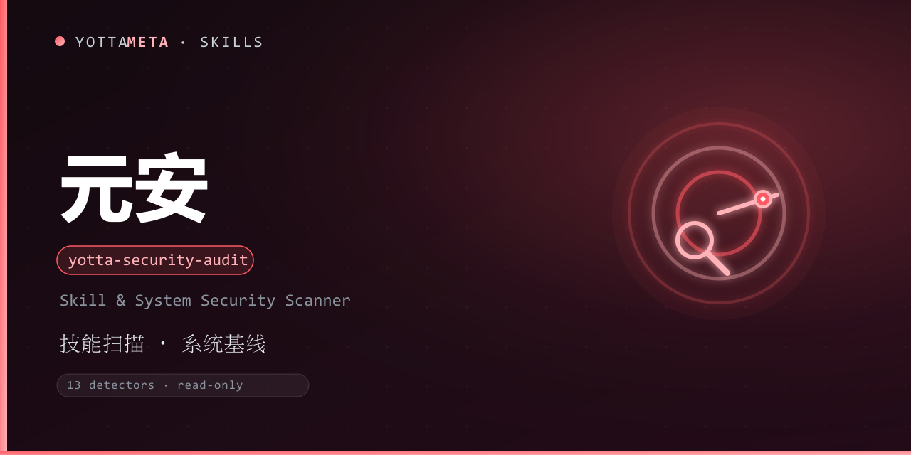

<p align="center"><b>Language</b>: <a href="./README.md">English</a> · 中文</p>

<p align="center">
  
</p>

<h1 align="center">yotta-security-audit · 元安</h1>

<p align="center">YottaMeta 自有的 AI 技能供应链与系统安全扫描引擎：<b>检测技能恶意模式 · 扫描系统安全基线</b>，纯只读、零依赖、有纪律。适用于安装新技能前、定期审计已装技能、检查系统安全基线等需要正确性与安全性的场景。</p>
<p align="center">检测到安全审计 / 技能安全检查 / 恶意检测 / 供应链安全 / 系统安全基线 / scan skills / supply chain / malicious skill / 扫描技能 等意图时自动激活；安装任何新技能前建议先运行——<b>不靠关键词碰运气，按待审计的目标判定</b>。</p>
<p align="center">Python 3.8+ 标准库实现，零外部依赖；Windows + Linux 通用；只读检测、报告默认脱敏、含授权与法律边界声明。</p>

<p align="center">
  <a href="LICENSE"></a>
  <a href="https://agentskills.io/"></a>
  <a href="https://www.npmjs.com/package/@yottameta/yotta-security-audit"></a>
  <a href="https://github.com/YottaMeta/yotta-security-audit"></a>
  <a href="https://github.com/YottaMeta/yotta-security-audit/commits/main"></a>
  <a href="https://github.com/YottaMeta/yotta-security-audit"></a>
</p>

## 这是什么

AI 技能正成为供应链攻击的新入口：一个「看起来正常」的技能，可能在安装期或运行期悄悄窃取凭据、外传数据、植入后门。元安把这类高危模式固化成 13 类检测器，并配合系统安全基线扫描，在安装前与运行中识别风险。

它不是某个平台的专属功能，而是一份与智能体无关的工具包：装进任何支持 Agent Skills 的智能体即可按需调用。只读检测、报告脱敏、绝不改动系统，也不需要常驻服务。

## 核心价值

- **双模式覆盖**：技能模式（默认）扫描 AI 技能目录；系统模式扫描系统安全基线（Windows / Linux 平台感知）。
- **13 类检测器**：覆盖后门、凭据窃取、数据外传、持久化、供应链安装钩子、隐藏字符、高熵载荷等高危模式。
- **只读有纪律**：所有检测均为读取操作；系统模式也只运行只读命令，绝不执行修复、删除或查杀。
- **报告默认脱敏**：不输出私钥内容、环境变量值、完整凭据，只给路径、模式与建议。
- **自动发现技能目录**：扫描全部已装技能时自动发现 17 类智能体技能目录。
- **自扫不误报**：扫描器可扫描自身而不产生中高危误报（签名规则数据文件自动豁免）。

## 核心优势

| 优势 | 说明 |
|---|---|
| **检测器可解释** | 13 类检测器各有明确关注点与默认级别，命中即定位到具体模式与处置建议 |
| **平台感知** | 系统模式按 Windows / Linux 自适应，只读命令不写系统 |
| **分级退出码** | 0=干净 / 1=medium / 2=high / 3=critical / 4=错误，便于接入自动化与 CI |
| **规则可扩展** | 规则表位于 scripts/audit_rules.py，可用 --ioc-db 传入自有威胁情报 |
| **授权与法律边界** | 只允许审计已获授权目标；未经授权扫描他人系统违反《网络安全法》与《刑法》285/286 条 |
| **零依赖** | Python 3.8+ 标准库，无 daemon / 无数据库；Windows + Linux 通用 |
| **生态分发** | GitHub + npm 双源同步发布；npx / install.sh / 手动复制三种安装方式 |

## 功能体系

| 能力 | 说明 |
|---|---|
| 技能模式（--target skill） | 扫描 AI 技能目录，13 类检测器命中恶意模式；自动发现 17 类智能体技能目录 |
| 系统模式（--target system） | 系统安全基线扫描（启动项、计划任务、服务、防火墙、共享、权限点等） |
| 单目录扫描（--path） | 安装新技能前，先扫描其目录 |
| 报告输出 | 文本 + --json 结构化 + --report 生成 Markdown 报告 |
| 级别过滤（--severity） | 只报告 high 及以上 |

## 13 类检测器

| 检测器 | 关注点 | 默认级别 |
|---|---|---|
| DownloadExec | 下载后通过管道或落地文件交给 shell 执行 | critical |
| Obfuscation | 动态求值、编码字符串构造、base64 解码后执行 | high |
| Persistence | 定时任务、启动代理/守护、shell 配置、注册表启动项写入 | high |
| Exfiltration | 读取敏感文件后外传、打包上传 | high |
| CredentialTheft | SSH/云凭据/浏览器数据/钥匙串访问 | critical |
| NetworkCall | 反向连接、原始套接字、HTTP 客户端（多为上下文相关） | medium |
| PrivilegeEscalation | 权限位修改、setuid、加入管理员组 | high |
| SocialEngineering | 社会工程话术命名（文件名） | medium |
| Base64 | 超长 base64 编码串（解码含敏感关键字则升级） | medium→high |
| IOCMatch | 已知恶意 IP/域名/URL 模式/文件哈希 | critical |
| PostInstallHook | 安装期生命周期脚本（下载/执行为 critical） | high→critical |
| HiddenChar | 零宽字符与双向覆盖字符 | medium |
| Entropy | 高熵编码串（疑似混淆/加密载荷） | medium |

> 规则表位于 `scripts/audit_rules.py`（签名数据文件，自扫豁免），可用 `--ioc-db` 传入自有威胁情报。

## 使用示例

```bash
# 扫描所有已发现的技能（17 类智能体目录）
python3 scripts/yotta_audit.py --target skill

# 扫描单个技能目录
python3 scripts/yotta_audit.py --path ./some-skill

# 系统安全基线（当前平台）
python3 scripts/yotta_audit.py --target system --platform auto

# JSON + 生成 Markdown 报告
python3 scripts/yotta_audit.py --path ./some-skill --json --report report.md

# 只报告 high 及以上
python3 scripts/yotta_audit.py --path ./some-skill --severity high
```

**exit code 语义**：0 = 干净 / 仅 low；1 = medium；2 = high；3 = critical；4 = 扫描器错误。

## 安装

三种方式任选其一，技能文件统一从 **npm** 获取（GitHub 无代理时较慢，npm 可配国内镜像加速）。

### 方式一：npm（推荐，一行安装）
```bash
# 国内加速（可选）：npm config set registry https://registry.npmmirror.com
npx -y @yottameta/yotta-security-audit -g
npx -y @yottameta/yotta-security-audit --dir <你的技能目录>   # 任意智能体：指定目录安装
```
> 智能体不在预置列表里？用 `--dir` 指定它的 skills 目录，或手动复制（方式三）。`--list` 可查看各智能体对应的默认目录。想手动拿文件也可 `npm pack @yottameta/yotta-security-audit` 解包后按方式二/三安装。

### 方式二：install.sh 一键安装
```bash
bash install.sh -g    # 用户级；bash install.sh --list 查看全部目录
bash install.sh --agent codex   # 指定智能体（--list 可查看可用项）
bash install.sh       # 项目级：自动检测已存在的 .claude/.cursor/.codex 等 skills 目录
bash install.sh --dir /path/to/skills
```
> 覆盖 17 类智能体，含国内 Trae / Qwen / Comate / CodeBuddy / Kimi。Windows 用户：装有 Git Bash 即可用；否则用方式三手动复制。

### 方式三：手动复制
把整个 `yotta-security-audit` 文件夹复制到目标智能体的 skills 目录。常见位置（用户级；Windows 用 `%USERPROFILE%`，Linux/macOS 用 `~`）：

| 智能体 | 用户级目录 | 项目级目录 |
|---|---|---|
| Codex | `%USERPROFILE%\.codex\skills\yotta-security-audit\` | `.codex\skills\` |
| Claude Code | `%USERPROFILE%\.claude\skills\yotta-security-audit\` | `.claude\skills\` |
| Cursor | `%USERPROFILE%\.cursor\skills\yotta-security-audit\` | `.cursor\skills\` |
| Windsurf | `%USERPROFILE%\.codeium\windsurf\skills\yotta-security-audit\` | `.windsurf\skills\` |
| opencode | `%USERPROFILE%\.config\opencode\skills\yotta-security-audit\` | `.opencode\skills\` |
| Gemini | `%USERPROFILE%\.gemini\skills\yotta-security-audit\` | `.gemini\skills\` |
| Goose | `%USERPROFILE%\.config\goose\skills\yotta-security-audit\` | `.goose\skills\` |
| Amp | `%USERPROFILE%\.config\agents\skills\yotta-security-audit\` | `.agents\skills\` |
| Kiro | `%USERPROFILE%\.kiro\skills\yotta-security-audit\` | `.kiro\skills\` |
| WorkBuddy | `%USERPROFILE%\.workbuddy\skills\yotta-security-audit\` | `.workbuddy\skills\` |
| Trae Code CLI | `%USERPROFILE%\.traecli\skills\yotta-security-audit\` | `.traecli\skills\` |
| Trae IDE（国内） | `%USERPROFILE%\.trae-cn\skills\yotta-security-audit\` | `.trae\skills\` |
| Qwen Code | `%USERPROFILE%\.qwen\skills\yotta-security-audit\` | `.qwen\skills\` |
| Comate | `%USERPROFILE%\.comate\skills\yotta-security-audit\` | `.comate\skills\` |
| CodeBuddy | `%USERPROFILE%\.codebuddy\skills\yotta-security-audit\` | `.codebuddy\skills\` |
| Kimi | `%USERPROFILE%\.kimi\skills\yotta-security-audit\` | `.kimi\skills\` |
| 通用 AGENTS.md | `%USERPROFILE%\.agents\skills\yotta-security-audit\` | `.agents\skills\` |

> Codex 默认目录若设置了环境变量 `CODEX_HOME`，以该变量为准；opencode 若设置 `XDG_CONFIG_HOME` 同理。`.agents\skills` 并非通用目录，仅 OpenCode / Cursor / Cline / Amp / Kimi / Gemini CLI / GitHub Copilot 等会读取，**Claude Code 与 Codex 默认不读**。不确定时用 `--dir` 指定，或让该智能体自行安装。

## 升级 / 卸载

- **升级**：重新安装最新版覆盖即可——`npx -y @yottameta/yotta-security-audit -g` 或重跑 `bash install.sh -g`。技能目录内的旧文件会被覆盖；不影响项目中已有的其他文件。
- **卸载**：删除目标智能体 skills 目录下的 `yotta-security-audit` 文件夹（各智能体目录见上表）即可。卸载后本技能不再生效。

## 常见问题

- **会主动修复风险吗？** 不会。元安只读检测与报告，绝不执行修复、删除或查杀。发现风险应建议用户先隔离、停止使用，再人工复核。
- **只扫技能不够吗，为什么还要系统模式？** 恶意技能常通过启动项、计划任务、服务等持久化到系统。系统模式帮你检查这些基线点，双模式互补。
- **扫描别的机器合规吗？** 只允许对已获授权目标检测。未经授权扫描他人系统违反《网络安全法》与《刑法》285/286 条，使用者自行承担法律责任。
- **首次运行会不会误报？** 检测器按模式与上下文给级别，NetworkCall / 高熵 / URL 等多属上下文相关提示，需结合场景判断；扫描器自扫有豁免，不产生中高危误报。

## 相关技能

同属 YottaMeta 技能矩阵（安全家族）：[yotta-vetter](https://github.com/YottaMeta/yotta-vetter)（元审，安装前四阶段初审）先做来源→代码→权限→风险审查，发现 high 及以上会引导跑元安深度扫描；[yotta-memory](https://github.com/YottaMeta/yotta-memory)（元忆）负责跨会话长期记忆。

## 开发与校验

本项目内运行：`python tools/validate-skill.py yotta-security-audit`。

## 许可证

MIT © YottaMeta —— 详见 [LICENSE](./LICENSE)。品牌声明见 [NOTICE](./NOTICE)。上游来源致谢：检测方向受 SlowMist 公开的 ClawHub 恶意技能威胁情报报告启发，实现为 YottaMeta 自有。
